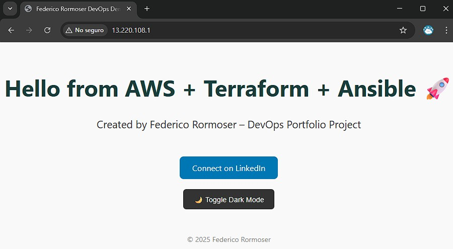
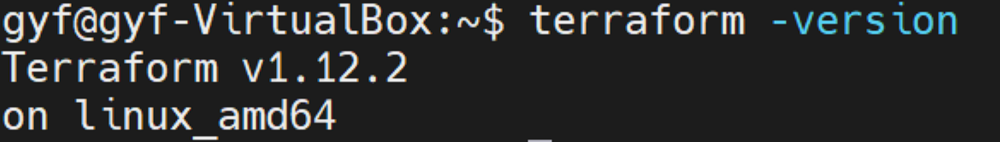
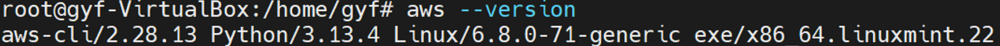
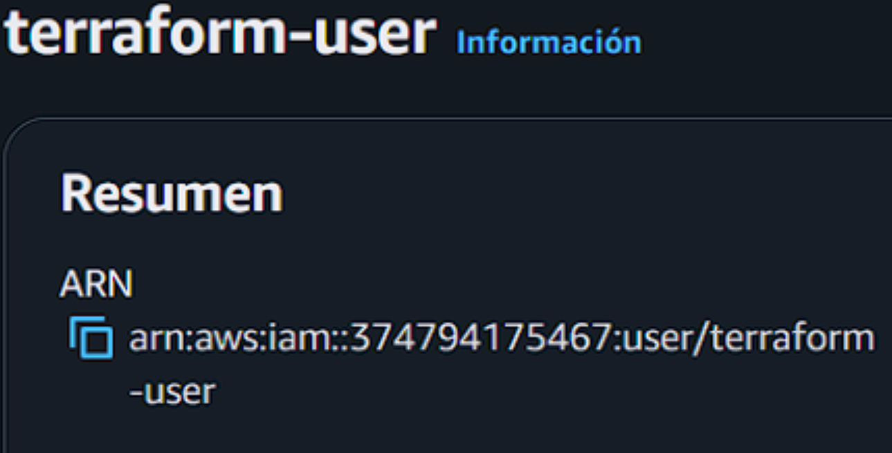
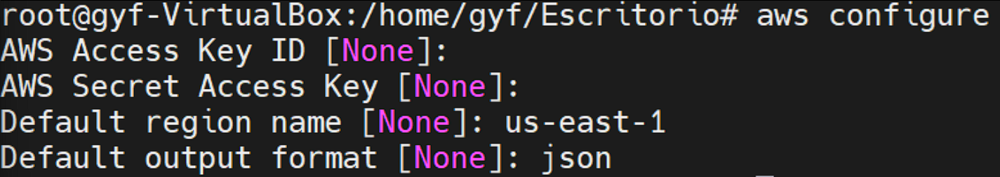
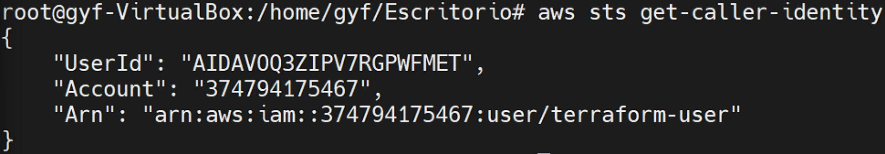
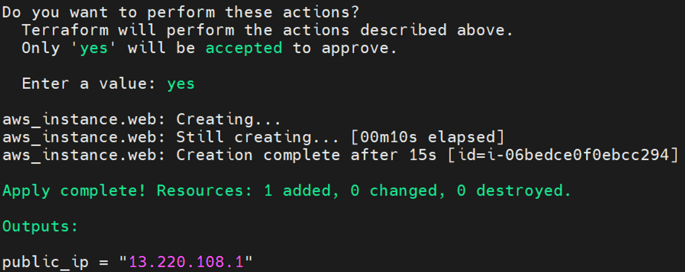
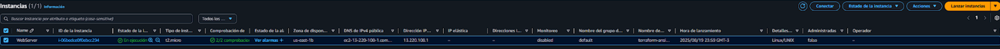
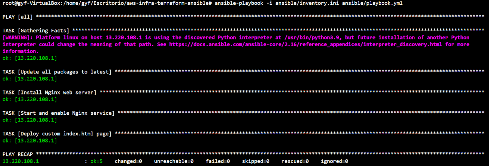
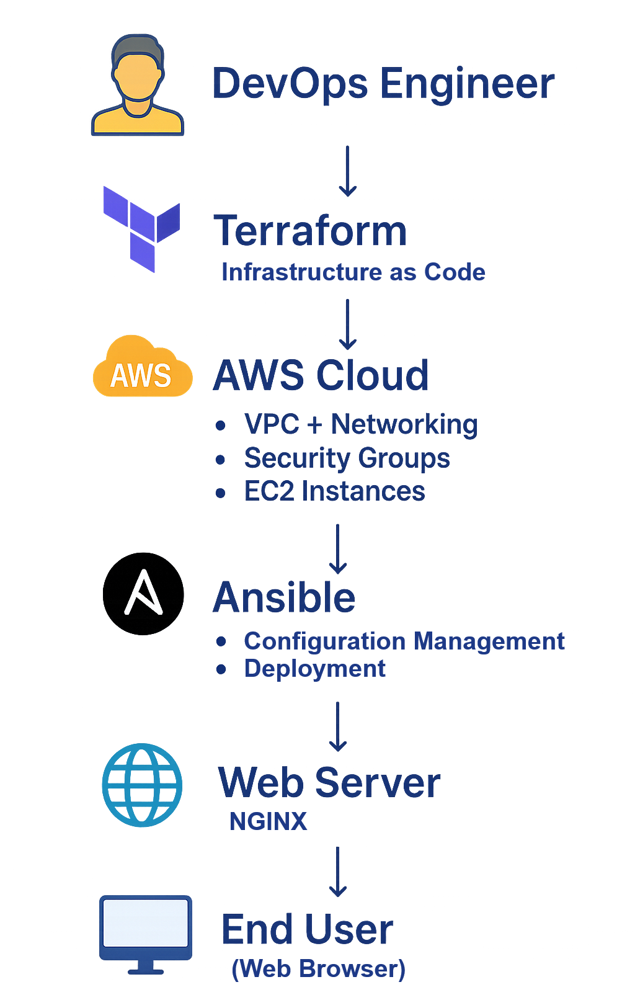

# **🚀 Scalable AWS Infrastructure with Terraform & Ansible**

This project showcases a **real-world DevOps workflow** combining:

- **Terraform** -- Infrastructure as Code (IaC) for provisioning AWS
  resources

- **Ansible** -- Automated configuration management

- **AWS EC2 + Nginx** -- Running a custom branded web page

👉 **Visible Result:**  A fully provisioned EC2 instance with Nginx serving a custom branded web page.  
serving a custom branded web page.

🌍 **Demo Online:**  
The original AWS EC2 public IP used in this project (`13.220.108.1`) is no longer active.  
For demo purposes, the deployed static site has been uploaded to **Netlify** for visualization:  
🔗 [Live Demo on Netlify](https://aws-infra-terraform-ansible.netlify.app/)  



## **🔑 Key Outcomes**

- AWS infrastructure provisioned automatically with **Terraform**

- **Configuration automation** with Ansible (Nginx + custom web page)

- Fully reproducible setup with **Git version control** and
  documentation

- **Screenshots & diagrams** for visual proof of the workflow


## **🛠️ Tech Stack**

- **Terraform v1.12.2** -- Infrastructure as Code

- **Ansible v2.16.3** -- Configuration management & automation

- **AWS CLI v2.28.13** -- IAM authentication & resource provisioning

- **Amazon Linux 2023 (EC2 AMI)** -- Server OS

- **Nginx** -- Web server

- **Linux Mint / Ubuntu** -- Local environment

- **Git** -- Version control


## **📂 Repository Structure**
```
aws-infra-terraform-ansible/

├─ terraform/

│ └─ main.tf \# Terraform config for EC2

├─ ansible/

│ ├─ playbook.yml \# Ansible playbook (Nginx + custom HTML)

│ └─ inventory.ini \# Inventory with EC2 public IP

├─ images/ 

│ ├─ architecture.png \# Architecture diagram

│ ├─ demo.png \# Screenshot of deployed page

│ ├─ aws_configure.png                         # AWS CLI configure command  
│ ├─ aws--version.png                          # AWS CLI version check  
│ ├─ aws_sts_get-calller-identity.png # Verify identity with STS  
│ ├─ tf_aws_user.png                           # IAM user for Terraform  

│ ├─ terraform-version.png                     # Terraform version check  
│ ├─ terraform_apply+public_ip.png             # Terraform apply output with public IP  
│ ├─ EC2-instance.png                          # AWS EC2 instance screenshot  

│  └─ ansible-run-playbook.png                 # Ansible playbook execution output

└─ README.md
```
## **⚙️ Setup Guide**

### **1️⃣ Install Terraform**

[[Terraform Installation
Guide]](https://developer.hashicorp.com/terraform/install)
```
sudo apt update && sudo apt install terraform

terraform -version
```


### **2️⃣ AWS CLI & Credentials**

Install AWS CLI:

[[Installing or updating to the latest version of the AWS
CLI]](https://docs.aws.amazon.com/cli/latest/userguide/getting-started-install.html)
```
curl \"https://awscli.amazonaws.com/awscli-exe-linux-x86_64.zip\" -o
\"awscliv2.zip\"

unzip awscliv2.zip

sudo ./aws/install

aws \--version

aws sts get-caller-identity
```
**Check AWS CLI Version**


**IAM User for Terraform**


**AWS CLI Configure**


**Verify Identity with STS**


### **3️⃣ Terraform Apply -- Provision EC2**

Terraform configuration (```terraform/main.tf```):
```
provider \"aws\" {
region = \"us-east-1\"
}

resource \"aws_instance\" \"web\" {
ami = \"ami-00ca32bbc84273381\" \# Amazon Linux 2023
instance_type = \"t2.micro\"

key_name = \"terraform-ansible-key\"

tags = {
Name = \"WebServer\"
}

}
output \"public_ip\" {
value = aws_instance.web.public_ip
}
```
Run:
```
cd terraform

terraform init

terraform apply
```
**Terraform Apply - Provision EC2 + Public IP**


**Deployed EC2 Instance in AWS Console**


### **4️⃣ Ansible -- Configure EC2**
Playbook excerpt (```ansible/playbook.yml```):
```
\- hosts: all

become: yes

tasks:

\- name: Install Nginx web server

yum:

name: nginx

state: present

\- name: Deploy custom index.html page

copy:

content: \"{{ index_content }}\"

dest: /usr/share/nginx/html/index.html
tags: deploy
```
see full playbook in ansible/playbook.yml

Inventory (```ansible/inventory.ini```):
```
\[web\]

X.X.X.X ansible_user=ec2-user
ansible_ssh_private_key_file=\~/.ssh/terraform-ansible-key.pem
```
Run:
```
ansible-playbook -i ansible/inventory.ini ansible/playbook.yml
```
**Running Ansible Playbook on EC2**


### **5️⃣ Verify in Browser**

Open:
```
http://\<EC2_PUBLIC_IP\>
```
🔗 [https://13.220.108.1](https://aws-infra-terraform-ansible.netlify.app)  

**Nginx Web Server with Custom Page**


## **📈 Future Improvements**

- Dynamic Ansible inventory with Terraform outputs

- SSL via Let's Encrypt

- Monitoring with CloudWatch / Prometheus

- CI/CD pipeline with GitHub Actions

- Load balancing + auto-scaling groups


## **📊 Architecture Diagram**



## **✨ Author**

**👨‍💻 Federico Rormoser -- DevOps Engineer \| Cloud Infrastructure \|
Automation**

🔗
[[LinkedIn]](https://www.linkedin.com/in/tu-perfil?utm_source=chatgpt.com)

💡 DevOps Engineer passionate about cloud infrastructure, automation,
and delivering reliable, scalable systems.
